# Safe High-Speed Control for Autonomous Vehicles: from PID to MPCC

**A reproducible study of safe and interpretable high-speed autonomous driving, developed through four
controllers built iteratively** and measured head-to-head on a deterministic benchmark. The question is
not merely *which controller is fastest*, but *which can be trusted and observed at the limit*.

CARLA 0.9.16 · ROS 2 Humble · CasADi + acados real-time MPC · live Foxglove telemetry

*An independent project developed in CARLA to evaluate conventional control methods and to serve as a reusable module for future work.*

<p align="center">
  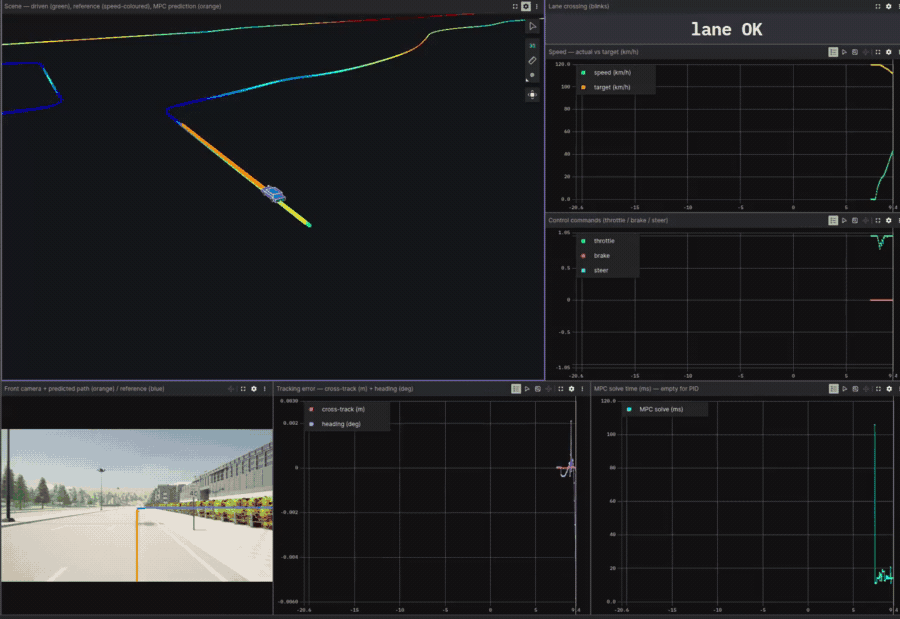
</p>

<table>
<tr>
<td align="center" width="25%"><strong>PID</strong><br><sub>baseline · 48 km/h</sub></td>
<td align="center" width="25%"><strong>PID++</strong><br><sub>+ feed-forward · 71 km/h</sub></td>
<td align="center" width="25%"><strong>MPC</strong><br><sub>tracking MPC · 77 km/h</sub></td>
<td align="center" width="25%"><strong>MPCC</strong><br><sub>contouring · 88 km/h</sub></td>
</tr>
<tr>
<td>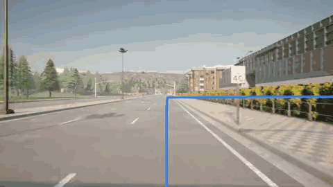</td>
<td>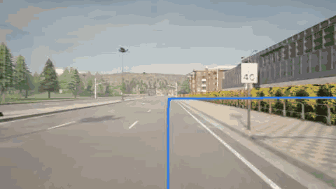</td>
<td>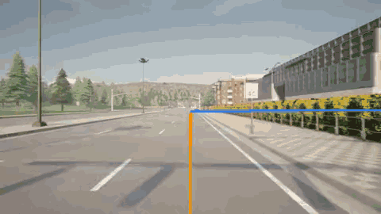</td>
<td>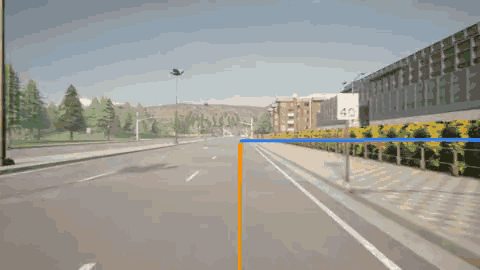</td>
</tr>
</table>

---

## Contents

- [Summary](#summary)
- [Controller Types](#controller-types)
- [Benchmarking](#benchmarking)
- [Iteration 1: PID](#iteration-1-pid)
- [Iteration 2: PID++](#iteration-2-pid)
- [Iteration 3: MPC](#iteration-3-mpc)
- [Iteration 4: MPCC](#iteration-4-mpcc)
- [Lane-keeping across the controllers](#lane-keeping-across-the-controllers)
- [Results in full](#results-in-full)
- [Reproduce everything](#reproduce-everything)
- [The testbed](#the-testbed)
- [Running the system](#running-the-system)
- [Build & reference](#build--reference)
- [Deep dives](#deep-dives)
- [Limitations & next steps](#limitations--next-steps)

---

## Summary

Four controllers, each motivated by the limitations of the previous one, evaluated on replicable benchmark routes:

- **Each iteration increases attainable speed.** Average speed on the flat suite rises
  **PID 44 → PID++ 65 → MPC 68 → MPCC 77 km/h**.
- **PID is the baseline.** It is a deliberately simple control method, equivalent to the default provided in CARLA's examples. Target speeds are kept low to ensure safe operation; raising them induces instability and safety risks, as the controller has **no model of the road**.
- **PID++ adds feed-forward in both axes and a wider grip budget.** It steers into each bend in open loop from an **Ackermann term** (wheelbase and road curvature) so the feedback only trims the residual, anticipates the curve-speed profile with a longitudinal feed-forward over a reworked speed PID (conditional anti-windup, filtered derivative), adds a steer-rate limit, and raises the cornering budget from ~0.7 g to ~1.4 g; together a **+47 %** average-speed gain. But every term keys off the *instantaneous* road geometry rather than a prediction of the road ahead, so PID++ remains **lane-unaware**: tracking error degrades **4×** (0.09 → 0.37 m) and the vehicle begins to cross lane markings (2.75 per route; 7 on the Town07 sharp-turns route).
- **MPC succeeds through foresight.** It matches PID++'s speed while achieving
  **zero lane invasions.** An internal model of the dynamics, combined with prediction over a horizon of future states and actions, makes it both **robust and interpretable**: its plan can be monitored and explicit constraints imposed, though the latter is not exploited in this project.
- **MPCC is the fastest.** It recasts tracking in the path's own coordinates (contouring control): a path-progress state allows it to pace toward a friction-limited curve-speed target rather than a fixed time reference, and it uses the widest grip budget of the four. It is the fastest controller at every curvature.
- **Limits of the 2D assumption.** Although MPC and MPCC model the future, at high reference speeds (up to 180 km/h) 3D terrain with unmodelled elevation induces instability and unsafe maneuvers. A principled speed cap of 100 km/h (`mpcc@100`) reduces 24 lane crossings to zero and avoids a major failure.
- **Command smoothness is treated as a deployment criterion.** The PID's throttle/brake command is near-bang-bang (oscillating between full throttle and braking) and is therefore not deployable on a physical vehicle. PID++ reduces the steering chatter but its longitudinal command still fluctuates; only the two model-based controllers, **MPC and MPCC alike**, eliminate the oscillation and produce deployment-grade actuation.
- **36 deterministic benchmark runs from a single command.** Every figure and number below is regenerated by
  `run_benchmark`.

<p align="center">
  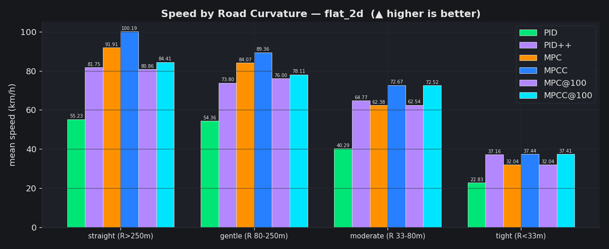
</p>

<p align="center"><em>Cornering speed by road curvature on the flat suite: a route-agnostic comparison.
MPCC is fastest and PID slowest at every curvature; MPC and PID++ alternate in rank within the tighter-radius bins.</em></p>

---

## Controller Types

Four trajectory-tracking controllers, developed iteratively, each addressing the limitations of the previous one.

| Controller | Description |
|---|---|
| **`PID`** | curvature-aware PID path follower, the reference baseline |
| **`PID++`** | the baseline augmented with lateral and longitudinal feed-forward, a steer-rate limit, and a larger grip budget (the name *PID++* is used here for convenience and does not denote an established method) |
| **`MPC`** | dynamic-bicycle **tracking MPC**, a CasADi optimal control problem solved by acados SQP-RTI |
| **`MPCC`** | **Model Predictive Contouring Control**: recasts tracking in the path's own (contouring) coordinates, pacing toward a friction-limited curve-speed target |

<table>
<tr>
<td align="center" width="25%"><strong>PID</strong><br><sub>baseline · 48 km/h</sub></td>
<td align="center" width="25%"><strong>PID++</strong><br><sub>+ feed-forward · 71 km/h</sub></td>
<td align="center" width="25%"><strong>MPC</strong><br><sub>tracking MPC · 77 km/h</sub></td>
<td align="center" width="25%"><strong>MPCC</strong><br><sub>contouring · 88 km/h</sub></td>
</tr>
<tr>
<td></td>
<td></td>
<td></td>
<td></td>
</tr>
</table>

<p align="center"><em> Driven under equal circumstances on the <code>highway_lane_changes</code> route.</em></p>

---

## Benchmarking

Each deterministic route is chosen to test a specific controller capability. Because the vehicle models assume a 2D world, an additional suite of 3D routes evaluates adaptability to unmodelled elevation.

- **Two scenario groups.** `flat_2d`: `sharp_turns` (Town07), `highway_speed` (Town04),
  `highway_lane_changes` (Town06), `roundabout` (Town03). `elevated_3d`: `country_road` and
  `curvy_downhill` (Town11).
- **Reproducible by construction.** `ros2 run carla_mpc_bringup run_benchmark` executes the full matrix
  on fixed seeds and writes the report. Every plot and table here is taken directly from it.

Every run is scored on:

| Metric | What it measures |
|---|---|
| `avg_speed_kmh` ↑ | average speed while actually driving (warm-up / run-down / stops excluded) |
| `distance_m` | distance driven before the run ended (context only) |
| `cte_rms_m` ↓ | RMS cross-track error, typical lateral distance from the path |
| `cte_max_m` ↓ | worst-case cross-track error over the run |
| `heading_rms_deg` ↓ | RMS heading error relative to the path tangent |
| `lat_accel_max` ↓ | peak lateral acceleration (hardest cornering load) |
| `lat_jerk_rms` ↓ | RMS lateral jerk, ride smoothness |
| `steer_rev_per_s` ↓ | steering reversals per second, wheel chatter / weave |
| `solve_p99_ms` | 99th-percentile controller solve time (real-time check) |
| `lane_invasions` ↓ | lane-marking crossings (normal on-path crossings masked out) |
| `lane_departures` ↓ | excursions > 1.5 m off the path (corner-cuts / large drifts) |


---

## Iteration 1: PID

A curvature-aware PID path follower.
The route is preprocessed once into an arc-length-resampled, smoothed path `s → (x, y, ψ, κ)`, and two
loops drive the vehicle: **laterally**, CARLA's stock PID steers toward a look-ahead point on the path
(pure-pursuit style); **longitudinally**, a PID tracks a speed profile built by the standard
*forward–backward* method: a pointwise curvature limit `v = curve_speed_factor · √(a_lat_max / |κ|)`
(a margin below the grip limit), capped at the cruise speed, followed by a backward pass so the vehicle can
always brake *into* a curve and a forward pass that bounds acceleration out of it. A throttle cap applied
whenever the steering command is large serves as a spin-out guard. It is the minimal baseline against which
every other controller is measured.

On the flat suite it is **slow but highly accurate**: `0.09 m` cross-track RMS, a conservative
`~0.7 g` of lateral acceleration, and **zero lane invasions**. The trade-off is speed: it is the slowest
at every curvature (55 km/h on straights, 23 km/h in tight turns). This is by design; raising the target
speed causes a loss of stability and unsafe control.

> **PID, flat suite:** 43.8 km/h avg · cte 0.09 m · 0 lane invasions · 0.72 g peak lateral
>
> Safe and accurate, at the cost of a very low target speed.

A more fundamental issue is **actuation quality**. Even with exponential command smoothing (an EWMA over
the last eight commands), the PID's longitudinal output oscillates between full throttle and braking,
effectively bang-bang control. On a physical vehicle this would be mechanically punishing and
uncomfortable; here it is tolerated only because the simulation has no powertrain or occupant to damage.
This alone renders the PID undeployable, independent of its speed.

<p align="center">
  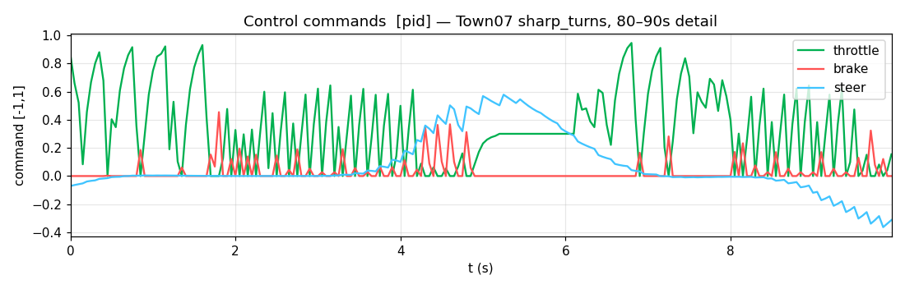
</p>

<p align="center"><em>PID commands on the Town07 sharp-turns route, a ten-second detail (≈80–90&nbsp;s). The throttle (green) slams between zero and near-full while the brake (red) fires in
bursts. Near-bang-bang longitudinal control that the EWMA smoothing does not tame.</em></p>

---

## Iteration 2: PID++

PID++ retains the PID's lateral structure (and its longitudinal gains) and adds four targeted refinements,
each a classical technique rather than a new controller:

- **Lateral curvature feed-forward.** It steers into the bend directly from the road geometry, an
  Ackermann term `δ_ff = lat_kff · atan(L · κ)` (a steering angle, normalized by the maximum steer before
  it is summed into the command), so the PID feedback only corrects the *residual* rather than accumulating
  a standing cross-track error through every curve.
- **Longitudinal refinements.** A reimplemented inline speed PID (the baseline gains, but no longer CARLA's
  stock longitudinal controller), augmented with conditional-integration anti-windup
  (the integral stops accumulating when the actuator is already saturated), a filtered-and-clamped
  derivative on the error (preserving the braking response on curve entry while rejecting noise spikes), and a
  low-passed feed-forward on the target rate so the mean speed follows the profile's acceleration/braking ramps
  rather than lagging above them.
- **Steer-rate limit.** An explicit slew-rate cap on the commanded steering angle (limiting jerk), in addition to
  the shared command smoothing.
- **A larger grip budget.** It corners at `a_lat_max = 14` (~1.4 g) on the *same* forward–backward
  speed profile the PID uses at `7` (~0.7 g); this wider budget is the primary source of the additional speed.

Together these raise cornering speed substantially: **+47 % average speed** over PID (64.6 km/h), a clear
improvement on straights and gentle bends. PID++ inherits the same exponential command smoothing and adds
the steer-rate limit, so the *steering* improves: reversals fall from 5.6 to 3.5 per second and the
throttle holds on straights. The **longitudinal axis, by contrast, is untouched**: through curves the
throttle/brake command still swings between full throttle and braking (on the Town07 route it sits at one
extreme or the other for nearly half the run) because neither the steer-rate limit nor the EWMA acts on the
longitudinal command. On actuation smoothness PID++ is therefore no closer to deployable than the baseline.

**The cost of this performance is significant.** With no model of its future position, the controller tracks
loosely and is not lane-aware:

- Tracking error degrades **4×**: cte RMS `0.37 m` (versus the PID's `0.09`), worst in turns
  (`0.45–0.47 m` on sharp_turns and the roundabout).
- The vehicle begins to **cross lane markings**: **2.75 crossings per route** on average, **7** on Town07's
  sharp turns, and 3 on the roundabout, where PID, MPC, and MPCC all record 0.

<p align="center">
  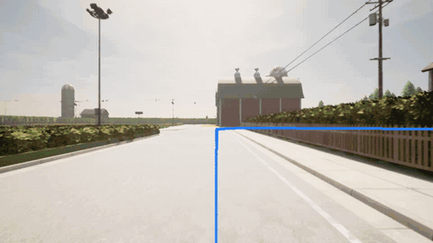
</p>

<p align="center"><em>PID++ on the Town07 sharp-turns route: fast, but it drifts wide and crosses the lane
edge. It has no representation of the lane and no model of its trajectory at this speed.</em></p>

The deeper limitation, which motivates the remainder of the study, is that **there is nothing to inspect.**
PID++ has no predicted trajectory, no explicit constraints, and no means of verifying that a limit will be
respected before it is violated. It is purely reactive and opaque.

---

## Iteration 3: MPC

The tracking MPC replaces reactive control with a model and an explicit plan. At every tick it solves a
receding-horizon optimal control problem over a **dynamic bicycle model** (CasADi → acados SQP-RTI),
predicting ~3 s ahead (sufficient to brake for a curve before reaching it) and applies only the first
command before re-solving from the new state.

Three design choices make this effective. **The model** is a 6-state dynamic bicycle `[X, Y, ψ, vₓ, v_y, r]`
with linear tires; it represents slip and lateral dynamics, providing the high-speed stability that a
slip-free kinematic model lacks. **The cost** is a *contouring decomposition*: the position error is split
into along-track (pacing) and cross-track (path-following) components, with the cross-track weighted far
higher, so the controller tracks the path tightly while the low along-track weight allows it to trade speed
against path rather than being rigidly paced to a position on the reference. **The tracked speed** is the
friction-limited grip-budget profile (`curve_speed_factor · √(a_lat_max / |κ|)`, capped at cruise and set by
the single physical parameter `a_lat_max`), so the planned cornering load is bounded *by construction*.
Reliable real-time solution requires an implicit IRK integrator for the stiff tire model, a `vₓ > 0` warm
start, and re-alignment of the heading at each tick so that a ±π wrap (e.g. heading due west) cannot unwind
into a spurious large steering command.

It **recovers the accuracy PID++ sacrificed and slightly exceeds its average speed (68 vs 65 km/h)**, the
first controller that is simultaneously fast, accurate, and inspectable:

| flat suite | PID | PID++ | **MPC** |
|---|---|---|---|
| avg speed (km/h) ↑ | 43.8 | 64.6 | **68.0** |
| cross-track RMS (m) ↓ | 0.09 | 0.37 | **0.09** |
| cross-track max (m) ↓ | 0.74 | 1.06 | **0.37** |
| lane invasions ↓ | 0 | 2.75 | **0** |
| solver p99 (ms) | n/a | n/a | **10.2** |

Faster than PID++, with tracking as tight as the PID, **zero lane invasions**, and a worst-case solve time of
**10 ms, one-fifth of the 50 ms control budget.** The principal advantage, however, is not a single metric:

<p align="center">
  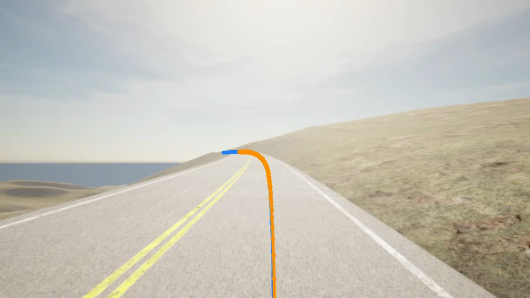
</p>

<p align="center"><em>The orange line is the controller's planned trajectory, projected into the driver
view. It is computed under hard limits on acceleration and steering angle, a soft (penalized)
lateral-acceleration cap, and a steering-change penalty, with a hard steering-rate clip applied to the
commanded steer, so the plan remains within the vehicle's envelope <strong>by construction.</strong> The
plan is observable and can be reasoned about.</em></p>

This is the essential difference from PID++: **comparable speed, but principled and observable.** The
controller's intended action is visible in advance, together with the bounds within which it operates.
The MPC is also the **first controller to remove the longitudinal bang-bang**: because the OCP penalizes
input changes, the throttle/brake command varies smoothly with no oscillation, achieved purely through the
optimization, with no post-hoc command filter. The actuation, not only the trajectory, is now
deployment-grade.

---

## Iteration 4: MPCC

Model Predictive Contouring Control recasts the problem in the path's own coordinates. The state
gains a **path-progress coordinate θ** and the input a **virtual progress speed `v_θ`**; the path is
parameterized by *space*, not time. In place of time-based tracking, two error terms maintain path-following (a
**contouring** error that pulls the vehicle onto the path and a **lag** error that keeps θ synchronized to the
true arc length) while the controller drives `v_θ` and `vₓ` toward a per-stage speed target. (Classic
MPCC rewards progress directly to obtain an emergent racing speed; this implementation deliberately
tracks a friction-limited target instead (see the caveat below), making it a contouring *tracker* rather than a
progress-maximizer.) Two implementation details make it practical: the vehicle body is a **blended**
kinematic/dynamic bicycle (kinematic below `v_blend`, where the linear tire's slip angles become hypersensitive
near standstill and cause a launch instability, and dynamic above), and, because the route is continuously
extended, the path cannot be compiled into the solver, so it is supplied as **per-stage parameters** (a local
arc-linearization around the warm-started θ, refreshed every solve), allowing the route to grow without
regenerating the solver.

One caveat is inherent to the formulation: with *linear* tires there is no grip saturation for the
optimizer to act against, so a true progress reward would simply exploit the soft friction circle. The
per-stage target is therefore the friction-limited curve speed `curve_speed_factor · √(a_lat_max / |κ|)`
(capped at cruise), with the friction circle (`a_grip` > `a_lat_max`) as a soft backstop: fast and
principled, but not yet a fully emergent grip-limited speed.

On the flat suite it is **the fastest at every curvature** (76.6 km/h average, **100 km/h on straights**)
with the **smoothest steering** of the four (2.49 reversals/s) and **zero lane invasions**. Its commands
are correspondingly the smoothest (a shallow EWMA on top of the OCP's steering penalties) and, like the
MPC and unlike the PID, fully deployable:

<p align="center">
  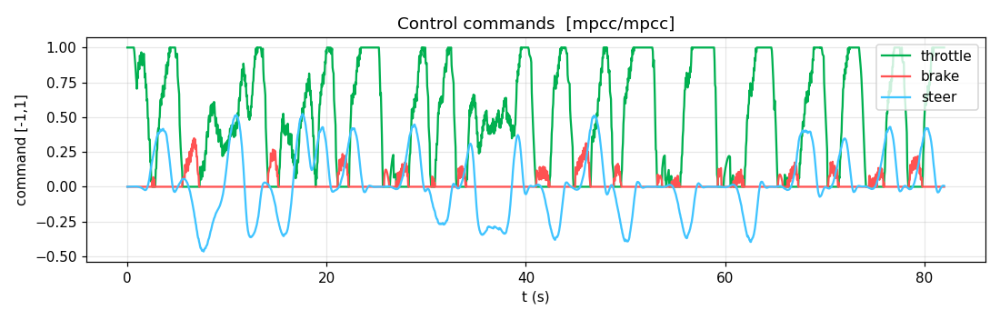
</p>

<p align="center"><em>MPCC commands on the same Town07 route: throttle and steering vary smoothly with
minimal braking, a direct contrast to the PID's bang-bang actuation above.</em></p>

<p align="center">
  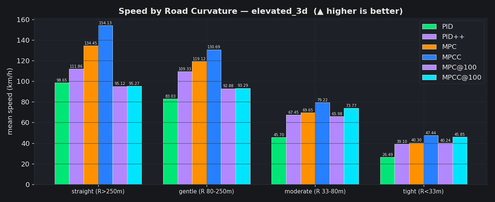
</p>

<p align="center"><em>The same curvature bins on the <strong>elevated</strong> suite, the routes on which
MPCC's 2D model fails (discussed below).</em></p>

### The limitation: a 2D model on 3D terrain

The vehicle model is **2D and assumes a planar world.** On Town11's elevated routes this assumption
fails, leading to a dangerous and barely recoverable off-road drift.

| `curvy_downhill` (Town11) | MPCC (uncapped) | **MPCC@100** |
|---|---|---|
| avg / peak speed (km/h) | 133 / **182** | 93 |
| cross-track RMS / max (m) ↓ | 1.04 / **7.31** | **0.07 / 0.66** |
| lane invasions ↓ | **24** | **0** |
| lane departures ↓ | **3** | **0** |

<p align="center">
  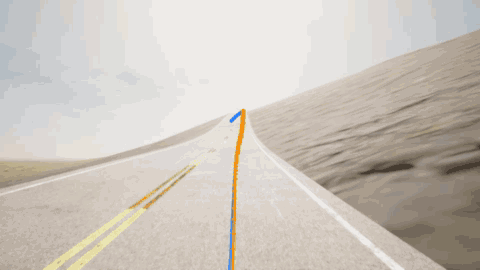
</p>

<p align="center"><em>MPCC on <code>curvy_downhill</code></em></p>

The remedy is principled rather than a workaround: capping the cruise speed (`mpcc@100`). On the same route
and controller, the capped variant yields **0 crossings, 0 departures, and 0.07 m cross-track error.**

---

## Lane-keeping across the controllers

> **The controllers that leave the lane are precisely those without a model adequate to their operating
> speed.** PID++ (reactive) crosses markings in flat turns; uncapped MPCC (2D) runs wide on
> 3D terrain. The PID (slow and conservative) and the modelled, constrained controllers (MPC and
> MPCC@100) stay within the lane.

<p align="center">
  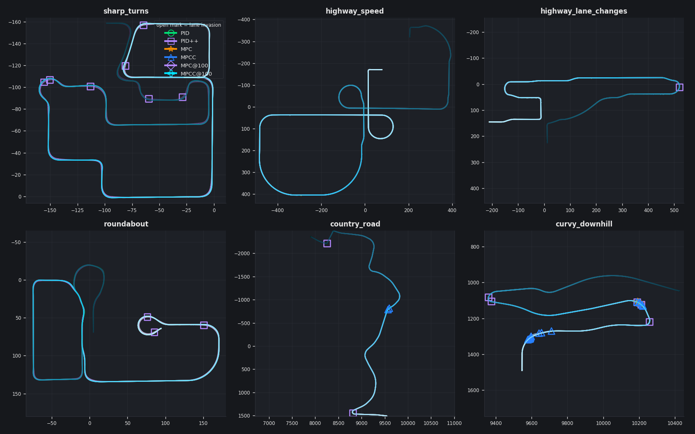
</p>


---

## Results in full

Values taken directly from `run_benchmark`. `@100` denotes a 100 km/h per-curve speed cap.

**Metrics: `flat_2d`**

| metric | PID | PID++ | MPC | MPCC | MPC@100 | MPCC@100 |
|---|---|---|---|---|---|---|
| avg_speed_kmh ↑ | 43.8 | 64.6 | 68.0 | **76.6** | 62.3 | 67.8 |
| cte_rms_m ↓ | **0.09** | 0.37 | **0.09** | 0.12 | 0.09 | 0.11 |
| cte_max_m ↓ | 0.74 | 1.06 | **0.37** | 0.43 | 0.37 | 0.43 |
| lat_accel_max (m/s²) | 7.07 | 13.50 | 11.48 | 12.84 | 11.33 | 12.54 |
| steer_rev_per_s ↓ | 5.56 | 3.45 | 4.13 | **2.49** | 4.48 | 2.49 |
| solve_p99_ms | n/a | n/a | **10.2** | 25.7 | 12.3 | 25.9 |
| lane_invasions ↓ | 0 | 2.75 | 0 | 0 | 0 | 0 |

**Speed by road curvature: `flat_2d` (km/h)**

| segment | PID | PID++ | MPC | MPCC |
|---|---|---|---|---|
| straight (R>250 m) | 55.2 | 81.8 | 91.9 | **100.2** |
| gentle (R 80–250 m) | 54.4 | 73.8 | 84.1 | **89.4** |
| moderate (R 33–80 m) | 40.3 | 64.8 | 62.4 | **72.7** |
| tight (R<33 m) | 22.8 | 37.2 | 32.0 | **37.4** |

**Metrics: `elevated_3d`**

| metric | PID | PID++ | MPC | MPCC | MPC@100 | MPCC@100 |
|---|---|---|---|---|---|---|
| avg_speed_kmh ↑ | 91.5 | 109.0 | 127.7 | 143.2 | 93.4 | 93.9 |
| cte_rms_m ↓ | 0.08 | 0.21 | 0.09 | 0.59 | 0.04 | 0.05 |
| cte_max_m ↓ | 0.98 | 1.48 | 0.78 | 4.30 | 0.28 | 0.50 |
| lat_accel_max (m/s²) | 13.43 | 33.66 | 16.96 | 23.90 | 11.40 | 14.64 |
| steer_rev_per_s ↓ | 5.85 | 5.98 | 4.85 | 3.82 | 8.73 | 5.91 |
| solve_p99_ms | n/a | n/a | 12.91 | 26.87 | 11.79 | 24.42 |
| lane_invasions ↓ | 0 | 3.50 | 1.00 | 13.00 | 0 | 0 |
| lane_departures ↓ | 0 | 0.50 | 0 | 1.50 | 0 | 0 |

**Speed by road curvature: `elevated_3d` (km/h)**

| segment | PID | PID++ | MPC | MPCC |
|---|---|---|---|---|
| straight (R>250 m) | 98.7 | 111.9 | 134.5 | 154.1 |
| gentle (R 80–250 m) | 83.0 | 109.3 | 119.1 | 130.7 |
| moderate (R 33–80 m) | 45.7 | 67.5 | 69.7 | 79.2 |
| tight (R<33 m) | 26.5 | 39.1 | 40.3 | 47.4 |

On the elevated routes the speed cap is decisive: uncapped MPCC is fastest (143 km/h average) but records
13 lane invasions and 1.5 departures per route (up to 7.3 m off the line on the downhill), whereas
`mpcc@100` reduces these to 0 / 0 at 0.05 m cross-track error. The aggregate bar
charts ([metrics_flat_2d.png](docs/assets/metrics_flat_2d.png),
[metrics_elevated_3d.png](docs/assets/metrics_elevated_3d.png)) are produced by the same run; see
[docs/evaluation.md](docs/evaluation.md).

---

## Reproduce everything

Every figure above is generated by a single command (with CARLA running under `--ros2`):

```bash
ros2 run carla_mpc_bringup run_benchmark \
    --scenarios src/carla_mpc_bringup/config/scenarios.yaml \
    --controllers pid,pidpp,mpc,mpcc,mpc@100,mpcc@100 \
    --repeats 1 --record-camera
```

It executes the full scenario matrix on fixed seeds and writes a timestamped report (HTML + CSV +
plots) to `logs/benchmarks/<timestamp>/`. The run can be restricted with `--groups flat_2d`, repeated for
statistics with `--repeats 3`, or re-aggregated from existing run logs (without re-driving) via
`benchmark_report`.

---

## The testbed

A reproducible CARLA 0.9.16 + ROS 2 environment: the ego vehicle is spawned through CARLA's native ROS 2
publisher and driven along generated routes, with all state observable live in a **Foxglove** dashboard. Each
control law is **ROS-independent behind a single interface** (`VehicleState → ControlCommand`), so a single
pipeline (spawn, tick, telemetry, logging, benchmark) drives all four controllers. The full design is
documented in [`docs/`](docs/).

---

## Running the system

Open two shells; in each, run `source setup_env.sh` (keeping `ROS_DOMAIN_ID` identical).

```bash
# Shell 1: start CARLA first (so /clock is available to late joiners)
cd $CARLA_ROOT && ./CarlaUE4.sh -RenderOffScreen --ros2

# Shell 2: the full control pipeline (PID by default; swap with controller:=mpcc)
ros2 launch carla_mpc_bringup carla_pid.launch.py controller:=mpcc
```

Then open **Foxglove Studio** → *Open connection* → `ws://localhost:8765` → *Import layout*
→ [`src/carla_mpc_bringup/foxglove/carla_mpc_layout.json`](src/carla_mpc_bringup/foxglove/carla_mpc_layout.json).
This provides the 3D scene (driven versus reference path, the predicted horizon, and the vehicle), the driver
camera with the path overlay, and live plots of speed, the throttle/brake/steer commands, the tracking errors,
and the MPC solve time. Every run additionally writes a human-readable log (metrics, plots, and a replay GIF)
to `logs/runs/`.

```bash
ros2 launch carla_mpc_bringup carla_pid.launch.py controller:=mpcc     # pid | pidpp | mpc | mpcc
ros2 launch carla_mpc_bringup carla_pid.launch.py route:=routes/sharp_turns.xml   # a fixed scenario
ros2 launch carla_mpc_bringup carla_pid.launch.py condition:=rainy_night          # named weather
ros2 launch carla_mpc_bringup carla_pid.launch.py record:=true                    # also save a rosbag
```

---

## Build & reference

<details>
<summary><strong>Install (one time)</strong>: Ubuntu 22.04 + ROS 2 Humble</summary>

### 1. Python deps + CARLA 0.9.16 wheel (into the uv venv)

```bash
uv venv --python 3.10 .venv                                  # if it doesn't exist
uv pip install --python .venv/bin/python -r requirements.txt # numpy, pyyaml, networkx, casadi, scipy, opencv
uv pip install --python .venv/bin/python \
  $CARLA_ROOT/PythonAPI/carla/dist/carla-0.9.16-cp310-cp310-manylinux_2_31_x86_64.whl
```

`CARLA_ROOT` defaults to `~/autonomousdriving/Carla/CARLA_0.9.16` (override in your shell). The PID
also uses CARLA's `agents` package (PID law + GlobalRoutePlanner) from `$CARLA_ROOT/PythonAPI/carla`;
`setup_env.sh` places it on `PYTHONPATH` automatically.

### 2. Foxglove bridge + build the workspace

```bash
sudo apt install ros-humble-foxglove-bridge
colcon build
```

### 3. acados (only for the MPC / MPCC controllers; PID requires neither)

```bash
git clone https://github.com/acados/acados.git ~/acados
cd ~/acados && git submodule update --recursive --init
mkdir -p build && cd build && cmake -DACADOS_WITH_QPOASES=ON -DBUILD_SHARED_LIBS=ON .. && make install -j$(nproc)
uv pip install --python .venv/bin/python -e ~/acados/interfaces/acados_template
# t_renderer (one-time): python -c "from acados_template.utils import get_tera; get_tera(force_download=True)"
```

`setup_env.sh` exports `ACADOS_SOURCE_DIR`, `LD_LIBRARY_PATH`, and places the acados_template source on
`PYTHONPATH`. Full detail in [docs/mpc.md](docs/mpc.md).

> **setuptools pin (required).** colcon's `ament_python` build uses the legacy `setup.py develop` path
> removed in setuptools 80.x; it runs under the *system* `/usr/bin/python3`. Ubuntu 22.04 ships 59.6.0,
> which works; **do not** `pip install -U setuptools` system-wide. If colcon errors with
> `invalid command 'develop'`, pin `python3 -m pip install 'setuptools==58.2.0'`.

</details>

<details>
<summary><strong>Project layout</strong></summary>

```text
mpc/                                     # colcon workspace root
├── setup_env.sh                         # source this: ROS + ws overlay + venv + CARLA agents + acados
├── docs/                                # in-depth documentation (+ docs/assets/ for the figures above)
└── src/carla_mpc_bringup/               # the ROS2 package
    ├── config/                          # vehicle / carla / controller / conditions / scenarios YAML + routes/
    ├── carla_mpc_bringup/
    │   ├── core/                        # pure, shared, testable (no carla/rclpy): frames + config loader
    │   ├── sim/                         # CARLA-side: control_node (spawn+tick+drive+publish+log), GT, sensors, routing
    │   ├── control/                     # the controllers (ROS-free, swappable) + OCPs + vehicle models + reference path
    │   ├── eval/                        # offline evaluation (ROS-free): run logger, metrics, benchmark aggregator
    │   ├── viz/                         # ego marker + predicted/reference camera overlay
    │   └── tools/                       # CLI entry points (see below)
    ├── launch/                          # carla_pid (top-level) · spawn · foxglove
    └── foxglove/carla_mpc_layout.json   # importable Foxglove control dashboard
```

Each controller is interchangeable behind `ControllerInterface` and **ROS-independent**: it takes a
`VehicleState`, returns a `ControlCommand`, and exposes telemetry via `ControllerDebug`. The same
infrastructure drives all four. `control_node` is the single world ticker: it reads the ego state, queries the
controller for a command, applies it, and republishes the reference path, the predicted horizon, and a
stream of telemetry for Foxglove.

</details>

<details>
<summary><strong>Tools</strong>, all <code>console_scripts</code>: <code>ros2 run carla_mpc_bringup &lt;name&gt;</code></summary>

| Tool | Description |
|---|---|
| `control_node` | the control loop (usually launched, not run directly) |
| `run_benchmark` | drive the scenario suite × controllers, then report |
| `benchmark_report` | aggregate `logs/runs/*` into the HTML/CSV comparison report |
| `record_run` | record a run as a rosbag2 (+ manifest + config snapshot) |
| `review_run` | offline run review → metrics + `summary.json` (+ `review.png`) |
| `map_atlas` | render a town with numbered spawn points (for route building) |
| `route_lab` | build / verify explicit-waypoint routes from spawn-point numbers |
| `build_routes` | (re)build the route XMLs in `config/routes/` |
| `identify_grip` | estimate the ego's lateral grip limit from CARLA |
| `gt_pose_publisher` | the ground-truth path/odom + `gt_map→hero` anchor |
| `ego_model_publisher` | the 3D ego vehicle MarkerArray |
| `predicted_path_overlay` | project predicted + reference paths into the camera |

Full CLI reference: [docs/entrypoints.md](docs/entrypoints.md).

</details>

<details>
<summary><strong>Topics & data flow</strong></summary>

```text
CARLA (--ros2) ──Fast-DDS──> /carla/hero/cam_front/image (+/camera_info), /clock, /tf
        ▲ apply_control                                              │
        │                                                            ▼
control_node ── ticks the world, reads ego state, runs the controller, publishes:
   /controller/reference_path_3d (Path)   /controller/predicted_path (Path; MPC/MPCC)
   /controller/heatmap_{speed,curve} (Marker)   /controller/lane_invasion{,_marker,_type}
   /controller/{speed_kmh,target_speed_kmh,throttle,brake,steer,
                cross_track_error,heading_error_deg,solve_time_ms} (Float32)
gt_pose_publisher ──> /carla/hero/gt/{path,odom} + TF gt_map→hero
ego_model_publisher ──> /ego_model (MarkerArray, frame `hero`)
predicted_path_overlay ──> /controller/camera_overlay/image
                              everything ──> foxglove_bridge ──ws://:8765──> Foxglove
```

All path topics are published in the `gt_map` frame; the Foxglove 3D panel chases `hero` while drawing
those `gt_map` paths through the `gt_map → hero` edge. Full frame description in
[docs/architecture.md](docs/architecture.md).

</details>

<details>
<summary><strong>Customize</strong></summary>

- **Controller gains / speed / grip policy:** `config/controller.yaml` (`pid`, `pidpp`, `mpc`, `mpcc` blocks).
- **World / map / route / weather / cruise speed:** `config/carla.yaml`.
- **Ego + sensor rig:** `config/vehicle.yaml` (mounts in ROS convention; auto-converted).
- **Benchmark scenarios:** `config/scenarios.yaml` (grouped routes).
- **Validate configuration files without a running simulator:** `python -m carla_mpc_bringup.core.config_loader`.

</details>

---

## Deep dives

In-depth documentation lives in [`docs/`](docs/) and is written to be self-contained; begin with
[`docs/README.md`](docs/README.md).

| Doc | What it covers |
|---|---|
| [architecture.md](docs/architecture.md) | components, data flow, topic graph, TF tree |
| [execution_flow.md](docs/execution_flow.md) | step by step from `ros2 launch` to a vehicle driving in Foxglove |
| [configuration.md](docs/configuration.md) | every config file and its parameters |
| [pid_controllers.md](docs/pid_controllers.md) | the PID and PID++ control laws |
| [mpc.md](docs/mpc.md) | the dynamic-bicycle MPC **and** the MPCC contouring controller |
| [dynamics.md](docs/dynamics.md) | the vehicle models, tire models, grip/friction, and the OCP formulations |
| [evaluation.md](docs/evaluation.md) | the benchmark suite, metrics, and the comparison report |
| [recording.md](docs/recording.md) | the opt-in rosbag recording and offline review |

---

## Limitations & next steps

- **The vehicle models are 2D.** As shown in Iteration 4, the MPCC requires a speed cap on real elevation, a
  limitation the benchmark measures rather than conceals. Extending the model to account for road gradient is
  the natural next step.
- **MPCC's curve speed is a friction-limited feed-forward rather than emergent.** A truly emergent
  grip-limited speed would require a saturating (Pacejka) tire in the OCP, a more difficult real-time problem
  ([docs/mpc.md](docs/mpc.md) explains why it is not in the live solver).
- **tire and grip parameters are estimates.** `identify_grip` measures the vehicle's actual lateral limit from
  steady-state cornering
